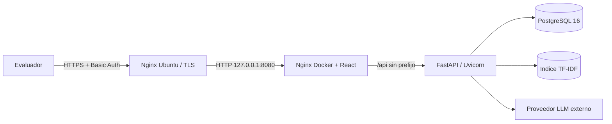

# Arquitectura de produccion para evaluacion

## Vista de despliegue

La aplicacion se ejecuta en una instancia AWS Lightsail Ubuntu 24.04 de 2 vCPU,
4 GB RAM y 80 GB SSD. El Nginx del host es el unico punto accesible desde
Internet. Docker publica el frontend exclusivamente en `127.0.0.1:8080`; FastAPI
y PostgreSQL no publican puertos.

## Flujo de red

1. Nginx Ubuntu termina TLS y exige Basic Authentication para todo el sitio.
2. El host sobrescribe `Host`, `X-Real-IP`, `X-Forwarded-For` y
   `X-Forwarded-Proto` antes de enviar la solicitud a `127.0.0.1:8080`.
3. Nginx Docker sirve React y reenvia `/api/` a `backend:8000`, retirando `/api`.
4. Uvicorn acepta proxy headers porque su puerto solo existe en la red Docker.
5. FastAPI accede a PostgreSQL por `db:5432` y al proveedor LLM por Internet.

## Arranque y readiness

1. PostgreSQL supera `pg_isready`.
2. El backend ejecuta `alembic upgrade head`.
3. FastAPI verifica tablas y carga los catalogos idempotentes.
4. Con `RAG_WARMUP_ON_START=true`, carga o construye el indice TF-IDF del
   `Documento_conceptual_2023.pdf` antes de quedar listo.
5. `/ready` comprueba PostgreSQL y el estado RAG. Solo entonces inicia frontend.

`/health` es liveness del proceso. `/ready` es readiness para recibir trafico.
El primer arranque puede tardar varios minutos en hardware limitado; los
reinicios posteriores reutilizan el volumen `rag_index`.

## Datos y reproducibilidad

- `postgres_data`: proyectos, catalogos, encuestas e historial de chat.
- `rag_index`: `chunks.json`, `embeddings.npz`, `vectorizer.joblib` e
  `index_metadata.json`.
- El RAG usa `pypdf`, scikit-learn y TF-IDF; no usa PyMuPDF ni un LLM local.
- El PDF 2023 y los CSV requeridos se incluyen como datos de solo lectura.
- `requirements-production.txt` fija las versiones Python de produccion y
  `package-lock.json` fija las dependencias frontend.

La aplicacion mantiene un worker para evitar duplicar estado en memoria y para
que las mediciones sean comparables. Los puntos de medida de base de datos,
contexto, RAG, prompt, LLM, total y TTFT pueden anadirse sin cambiar esta
topologia.

Las imagenes oficiales de Nginx y el backend conservan su usuario predeterminado.
Cambiar a usuarios no-root queda pendiente hasta definir una migracion de
propiedad para volumenes `rag_index` creados por despliegues anteriores.
